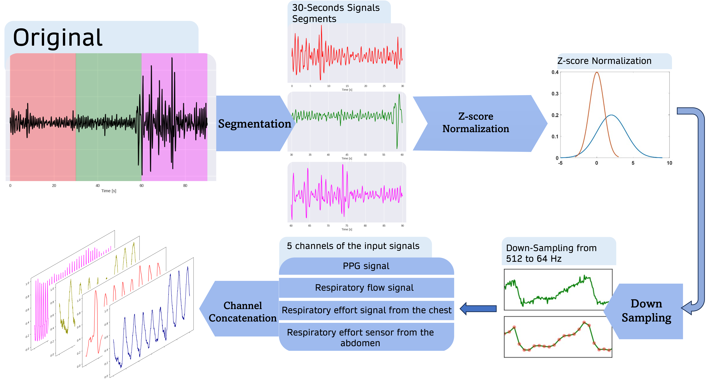

# Multimodal Sleep Stage and Sleep Apnea Classification Using Vision Transformer

This repository contains the official implementation of the paper:

**"Multimodal Sleep Stage and Sleep Apnea Classification Using Vision Transformer: A Multitask Explainable Learning Approach"**

> Kazemi, Kianoosh, Iman Azimi, Michelle Khine, Rami N. Khayat, Amir M. Rahmani, and Pasi Liljeberg. "Multimodal Sleep Stage and Sleep Apnea Classification Using Vision Transformer: A Multitask Explainable Learning Approach." 2025 47th Annual International Conference of the IEEE Engineering in Medicine and Biology Society (EMBC).
> DOI: 10.1109/EMBC58623.2025.11252880

---

## 🧠 Project Overview

Sleep is essential for health and quality of life. Accurate classification of sleep stages and detection of sleep disorders (e.g., apnea) is critical for monitoring well-being. This project presents a **1D Vision Transformer (ViT)** based **multitask model** for simultaneous classification of:

- **Sleep stages** (Wake, N1, N2, N3, REM)
- **Sleep disorders**, particularly **Obstructive Sleep Apnea (OSA)** and its subtypes

The model is trained and tested on **multimodal physiological signals**, including:
- Photoplethysmogram (PPG)
- Respiratory Flow
- Respiratory Effort (chest and abdomen)

It is designed for **wearable or home-based sleep monitoring**.

---

## 🧬 Data Preparation Pipeline



1. **Segmentation:** Signals are divided into 30-second segments.
2. **Z-score Normalization:** Channel-wise normalization.
3. **Downsampling:** From 512 Hz to 64 Hz using linear interpolation.
4. **Channel Concatenation:** 4–5 channels combined into final tensor shape `(samples, 1920, channels)`.

---

## 🔧 Model Architecture


- Input signals → patch embeddings
- Transformer encoder with multi-head self-attention (6 layers, 6 heads)
- MLP head followed by two output branches:
  - Sleep stage classification (5-class softmax)
  - Sleep disorder classification (multi-class softmax)
- Integrated **attention explainability** highlights which parts of the signal influenced classification

---

## 📁 Repository Structure

```
├── Interpretable_Sleep_Classification.py   # Main training script
├── vit.py                                  # Vision Transformer model (to be added)
├── data.py                                 # Dataset loading and preprocessing (to be added)
├── models/                                 # Trained weights will be saved here
├── Data_with_Apnea/                        # Input .npy data files
├── datapreparation.png                     # Data pipeline diagram
├── pipeline2.jpg                           # Model architecture diagram
├── README.md                               # This file
```

---

## 🚀 How to Run

### 1. Install Dependencies
```bash
pip install -r requirements.txt
```

### 2. Prepare Data
Place the following files in `Data_with_Apnea/`:
- `train_data.npy`, `train_label.npy`, `train_apnea_label.npy`
- `test_data.npy`, `test_label.npy`, `test_apnea_label.npy`

Ensure input shape: `(samples, 1920, 4 or 5 channels)`

### 3. Train the Model
```bash
python Interpretable_Sleep_Classification.py
```

### 4. Output
- Trained weights saved in `models/vit_8000samples/`
- Training logs printed epoch-wise

---

## 📈 Performance (as reported in the paper)
| Task | Accuracy | F1-Score | Kappa |
|------|----------|----------|--------|
| Sleep Stage Classification | 78% | 0.79 | 0.66 |
| Sleep Apnea Classification | 74% | 0.74 | 0.58 |

The model shows competitive performance on a real-world, annotated dataset of 123 subjects with balanced apnea subtype representation.

---

## 🔍 Explainability

Attention maps from the transformer are extracted to identify important signal segments (e.g., PPG troughs, respiratory peaks) contributing to decisions. This makes the model **clinically interpretable**, offering insight into its reasoning process.

---

## 📚 Citation
If you use this code or our ideas, please cite the following paper:

```
Kazemi, Kianoosh, Iman Azimi, Michelle Khine, Rami N. Khayat, Amir M. Rahmani, and Pasi Liljeberg. 
"Multimodal Sleep Stage and Sleep Apnea Classification Using Vision Transformer: A Multitask Explainable Learning Approach."
2025 47th Annual International Conference of the IEEE Engineering in Medicine and Biology Society (EMBC)..
```

---

## 💡 Acknowledgments
This work was supported by the **Finnish Foundation for Technology Promotion** and the **Nokia Foundation**.

---

## 📬 Contact
For inquiries, open an issue or email kianoosh.k.kazemi@utu.fi.
